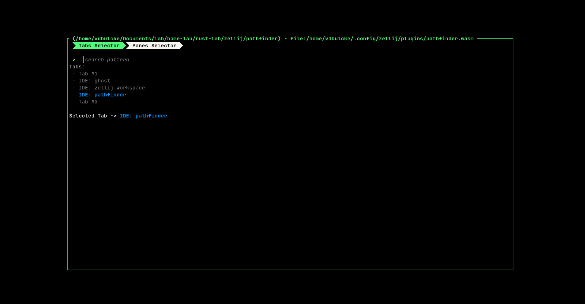
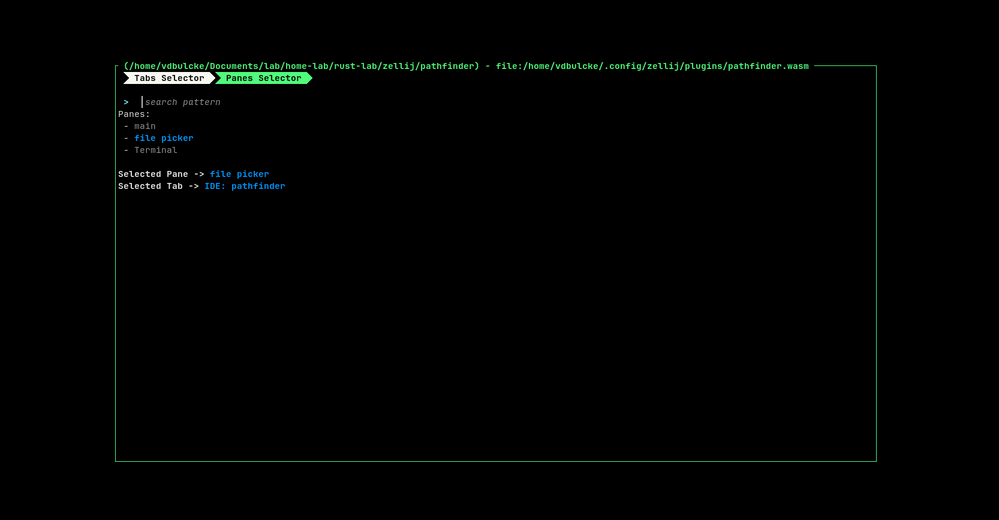

# Pathfinder

A [Zellij](https://zellij.dev) plugin for navigating opened tabs and panes.

Select a tab: 



Select pane from currently selected tab:
 



## Should I use this plugin? 

This is plugin is a mixed of functionalities from [session-manager](https://github.com/zellij-org/zellij/tree/main/default-plugins/session-manager) and [room](https://github.com/rvcas/room), you should look at those first.


## Requirements

Zellij version `v0.41.1` or later.


### Zellij Plugin Permission 

| Permission               | Why                                         |
| -------------------------|---------------------------------------------|
| `ReadApplicationState`   | Subscribe to Pane and tab events            |
| `ChangeApplicationState` | Setting plugin pane name, creating new tabs |


## Install

### Download WASM Binary


* Download `pathfinder.wasm` binary from [release page](https://github.com/vdbulcke/pathfinder/releases).
* Verify binary signature with cosign (see instruction bellow)
* copy binary to zellij plugin dir: 
     - `mv target/wasm32-wasi/release/pathfinder.wasm ~/.config/zellij/plugins/`

#### Validate Signature With Cosign

Make sure you have `cosign` installed locally (see [Cosign Install](https://docs.sigstore.dev/cosign/installation/)).

Then you can use the `./verify_signature.sh` in this repo: 

```bash
./verify_signature.sh PATH_TO_DOWNLOADED_ARCHIVE TAG_VERSION
```
for example
```bash
$ ./verify_signature.sh ~/Downloads/pathfinder.wasm v0.1.0

Checking Signature for version: v0.1.0
Verified OK

```


### Build from source

> WARNING: requires to have rust installed and wasm `rustup target add wasm32-wasi`

* `git clone git@github.com:vdbulcke/pathfinder.git`
* `cd pathfinder`
* `cargo build --release`
* `mv target/wasm32-wasi/release/pathfinder.wasm ~/.config/zellij/plugins/`


## Loading plugin 

### Via Zellij Config

```kdl
shared_except "locked" {
    bind "Ctrl y" {
        LaunchOrFocusPlugin "file:~/.config/zellij/plugins/pathfinder.wasm" {
            floating true
       
        }
    }
}
```
